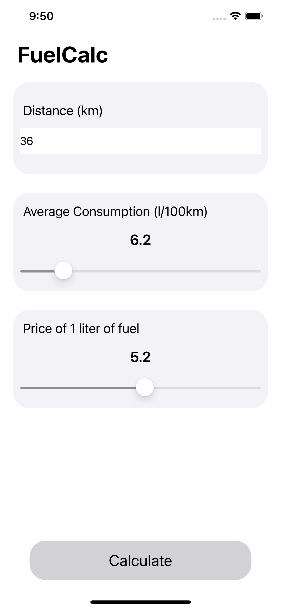

	

# MusicAll 
Calculator of travel costs that allows you to calculate how much money you will spend on fuel. This repository contains three versions of exactly the same working versions of application. The difference between them is technology that they were made - there is application made with UIKit, SwiftUI and cross-platform framework Flutter.

## Screenshots
### UIKit

	
	

### SwiftUI

	
	

### Flutter

	
	

## Features
- Support for light and dark mode
- Calculating the cost of fuel for a car trip

## Project structure
- [`FuelCalc-UIKit`](FuelCalc-UIKit) - project of application based on UIKit
- [`FuelCalc-SwiftUI`](FuelCalc-SwiftUI) - project of application based on SwiftUI
- [`fuel_calc_flutter`](fuel_calc_flutter) - project of application written by using Flutter

## Usage
Clone this repository, depending on which version do you want to launch.  
For UIKit or SwiftUI, open the project at Xcode. For Flutter version, you have to open the project by using Android Studio. 

## Author
Patryk Krajnik • patrykkrajnik@icloud.com

## License
Project based on [MIT License](LICENSE.md)